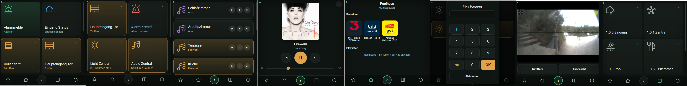
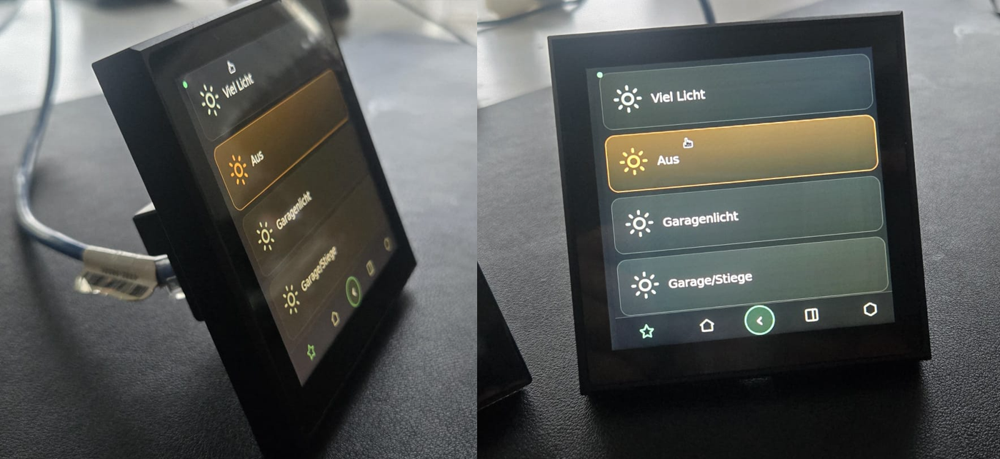
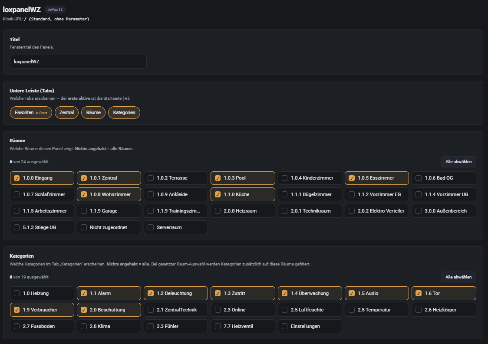
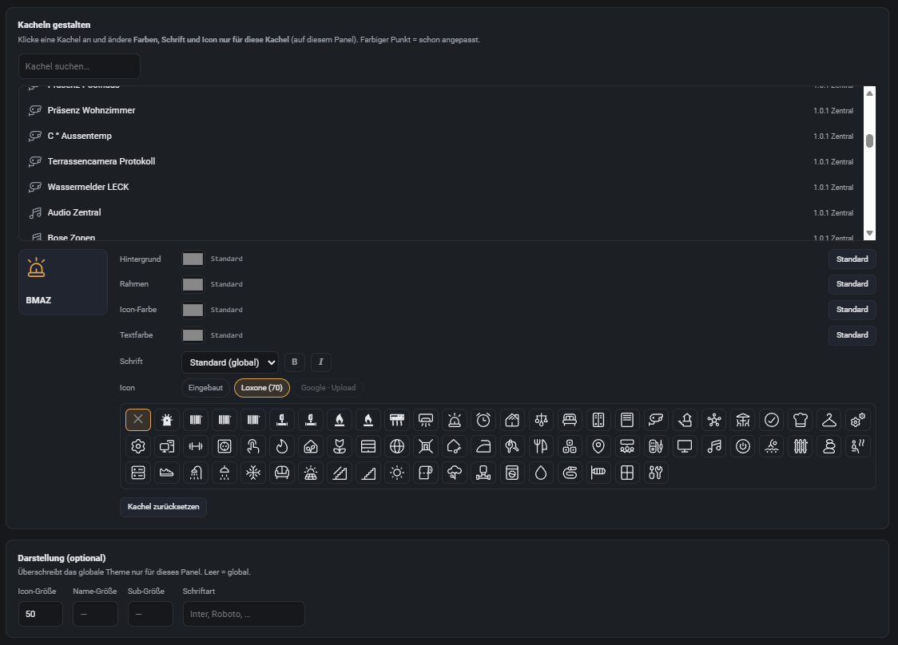
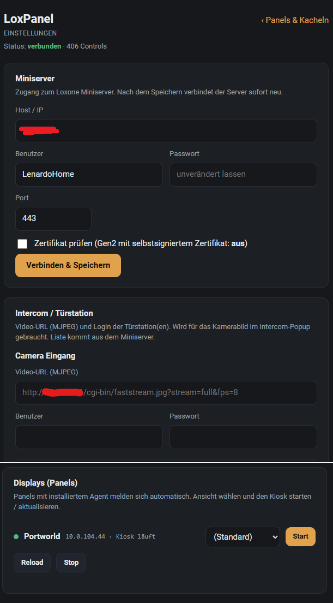
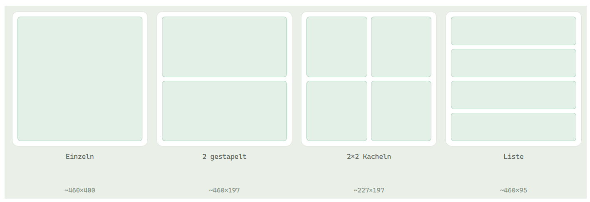

# LoxPanel

Eine **konfigurierbare Touch-Visu für Loxone**, die direkt über den Miniserver
läuft — ohne die Loxone-App, offen für alle Loxone-Nutzer. Ziel ist ein
**LoxBerry-Plugin** (Server + Konfigurations-Oberfläche); die Anzeige läuft im
Browser (Wandpanel / Tablet / Handy), z. B. als Chromium-Kiosk auf einem
4-Zoll-Linux-Panel.

> Stand: **lauffähige Web-Visu** (Python + aiohttp). Verbindet sich per
> WebSocket mit dem Miniserver (Token-Auth), liefert eine 480×480-Oberfläche und
> steuert live.

## Screenshots

**Visu am Panel** — Favoriten mit Status, Musik-Player, Musikauswahl, PIN-geschützte Tür, Intercom-Livebild, Räume:



**Am Wandpanel** (Linux-Panel im Chromium-Kiosk):



**Konfiguration im Browser** — Panel-Profile: pro Gerät Räume, Kategorien und Tabs an-/abwählen:



**Pro Kachel gestalten** — Hintergrund, Rahmen, Icon- und Textfarbe, Schrift und Icon (eingebaut / Loxone) je Kachel:



**Einstellungen** — Miniserver und Intercom eintragen, **Displays (Panels) automatisch finden und den Kiosk fernstarten**:



**Layout-Varianten** je Detailseite (einzeln / gestapelt / 2×2 / Liste):



## Funktionen

- **Navigation** wie die Loxone-App: Tabs **Favoriten / Zentral / Räume / Kategorien**, scrollbare Kacheln, Detailseiten.
- **Übersicht** mit Farben & Werten: aktive Kacheln orange, Alarm grün „Ok",
  Zentral-Bausteine mit Zähltext („Licht in X Räumen", „Musik in X Räumen"),
  Energie („x kW • y MWh", Einheiten-Skalierung), Temperatur, Statustexte.
- **Control-Typen**: LightControllerV2 (Stimmungen als Liste), Jalousie, Gate/Tor,
  IRoomControllerV2 (Heizung: Ist/Soll ± ), Switch/Pushbutton, Meter/Slider/Text.
- **Musik** (Loxone AudioZone): Zonen-Liste mit Mini-Player (◀ ⏯ ▶) und voller
  Raum-Player mit **Cover** (über Miniserver, kein direkter LMS-Zugriff).
- **Intercom** (Mobotix T25): **Live-Bild** (MJPEG-Proxy mit Auth), **Tür öffnen**
  & **Außenlicht**, **Klingel-Popup** (Server erkennt den `bell`-State und schiebt
  die Ansicht aufs Panel). Gegensprechen (SIP) folgt separat.
- **Theming** via `config/theme.json`: Kategorie-Farben, Zustandsfarben,
  Icon-/Schriftgrößen, sichtbare Tabs, Schrift.

## Architektur

```
Loxone Miniserver ──WebSocket(Token)──►  webvisu.py (aiohttp)
        ▲  (Befehle via loxone-api / jdev)      │  WebSocket + HTTP
        └───────────────────────────────────────┤
                                                 ▼
                                       Browser-Panel (480×480)
                                       (Chromium-Kiosk auf PX30 / Handy / Tablet)
```

- **loxone-api** (PyPI): Token-Auth (getkey2/getjwt), Struktur, Befehle.
- **loxone_ws.py**: eigener WebSocket-Client für Live-Werte (binäre State-Tabellen).
- **adapters.py**: pro Control-Typ ein Adapter (Zustand→Kachel, Aktion→Befehl).
- **webvisu.py**: Server — baut Views/Blocks, streamt sie per WebSocket, proxyt
  Icons/Cover/MJPEG, sendet das Theme.
- **panel.html**: die Single-Page-Visu (Kacheln, Detail-Panels, Tabs, Theme).

## Start (Entwicklung/Standalone)

```bash
pip install loxone-api            # zieht aiohttp mit
cp config/loxpanel.cfg.example config/loxpanel.cfg
#   -> Miniserver-Host/User/Pass eintragen (Datei ist gitignored)
python bin/webvisu.py             # -> http://localhost:8099
```

Theme anpassen: `config/theme.json`. Deployment aufs Wandpanel: siehe `deploy/`
(`DEPLOY.md`, systemd-Service, Chromium-Kiosk-Autostart).

## Installation (Docker)

Fertiges Multi-Arch-Image (amd64 / arm64 / **armv7** – läuft auch auf dem
Raspberry Pi) unter `ghcr.io/lenardo1/loxpanel:latest`.

### Portainer (Stack – empfohlen)

**Stacks → Add stack → Web editor**, einfügen und deployen:

```yaml
services:
  loxpanel:
    image: ghcr.io/lenardo1/loxpanel:latest
    container_name: loxpanel
    restart: unless-stopped
    ports:
      - "8099:8099"
    environment:
      LOXPANEL_MS_HOST: "192.168.1.50"     # Miniserver-IP
      LOXPANEL_MS_USER: "LoxoneUser"
      LOXPANEL_MS_PASS: "dein-passwort"
      LOXPANEL_MS_PORT: "443"
      LOXPANEL_MS_VERIFY_TLS: "false"       # Gen2 selbstsigniert -> false
    volumes:
      - loxpanel_config:/app/config          # panels.json / theme.json / loxpanel.cfg persistent
volumes:
  loxpanel_config:
```

Danach: Visu `http://<host>:8099`, Konfig `…/config`, Einstellungen `…/settings`.
Zugangsdaten hier per Env **oder** leer lassen und in `/settings` eintragen.
(Privates GHCR-Package: auf *public* stellen oder in Portainer unter *Registries*
`ghcr.io` + Token hinterlegen.)

### docker compose (aus dem Repo)

```bash
cp .env.example .env            # Miniserver-Host/User/Pass eintragen
docker compose up -d            # -> http://<docker-host>:8099
```

Details & Panel-Kiosk: `deploy/DOCKER.md` / `deploy/DEPLOY.md`. (Kein Umweg zum
LoxBerry-Plugin — gleiche Server-Basis, LoxBerry kann Docker-Plugins direkt einbinden.)

## Konfiguration (`config/loxpanel.cfg`, gitignored)

Enthält Zugangsdaten und wird **nicht** eingecheckt. Vorlage:
`config/loxpanel.cfg.example`. Abschnitte: `miniserver`, `mqtt` (optional),
`intercom` (T25-URL + Login).

## Panel-Profile (`config/panels.json`, gitignored)

**Ein** Server versorgt beliebig viele Panels — jedes Gerät kann eine **eigene
Visu** zeigen. Der Kiosk ruft die Seite mit `?panel=<id>` auf
(z. B. `http://loxberry:8099/?panel=erdgeschoss`); der Server lädt dann das
passende Profil aus `config/panels.json`. Pro Profil einstellbar:

- `tabs` — welche/Reihenfolge der unteren Leiste (`favoriten`/`zentral`/`raeume`/`kategorien`)
- `rooms` / `cats` — Whitelist, **welche** Räume/Kategorien das Panel zeigt
  (UUID **oder** Name, Teilstring genügt; leer = alle). So zeigt das EG-Panel
  z. B. nur Küche/Wohnzimmer/Terrasse, das OG-Panel nur die Schlafräume. Die
  Kategorie-Ansicht wird passend auf die erlaubten Räume mitgefiltert.
- `ui` — Theme-Override (`iconSize`/`nameSize`/`subSize`/`font`)
- `states` — Zustandsfarben-Override

Ohne `panels.json` verhält sich jedes Panel wie `default` (alles sichtbar).
Vorlage: `config/panels.json.example`.

**Konfig-Oberfläche:** `http://localhost:8099/config` — listet alle Räume und
Kategorien der Anlage als **anklickbare Liste**; pro Panel Tabs, sichtbare
Räume/Kategorien und Schrift/Größe wählen, „Speichern" schreibt `panels.json`.
Diese Seite wandert später als PHP-Frontend ins LoxBerry-Plugin.

## Roadmap

- LoxBerry-Plugin (Server + grafisches Konfig-UI, Server läuft auf LoxBerry).
- Weitere Control-Typen / Heizung-Modus-Umschaltung.
- Intercom Teil 2: Gegensprechen (SIP-Client baresip/linphone auf dem Panel).
- Optionaler openHASP-Renderer (ESP32) als kuratierter Satellit.
