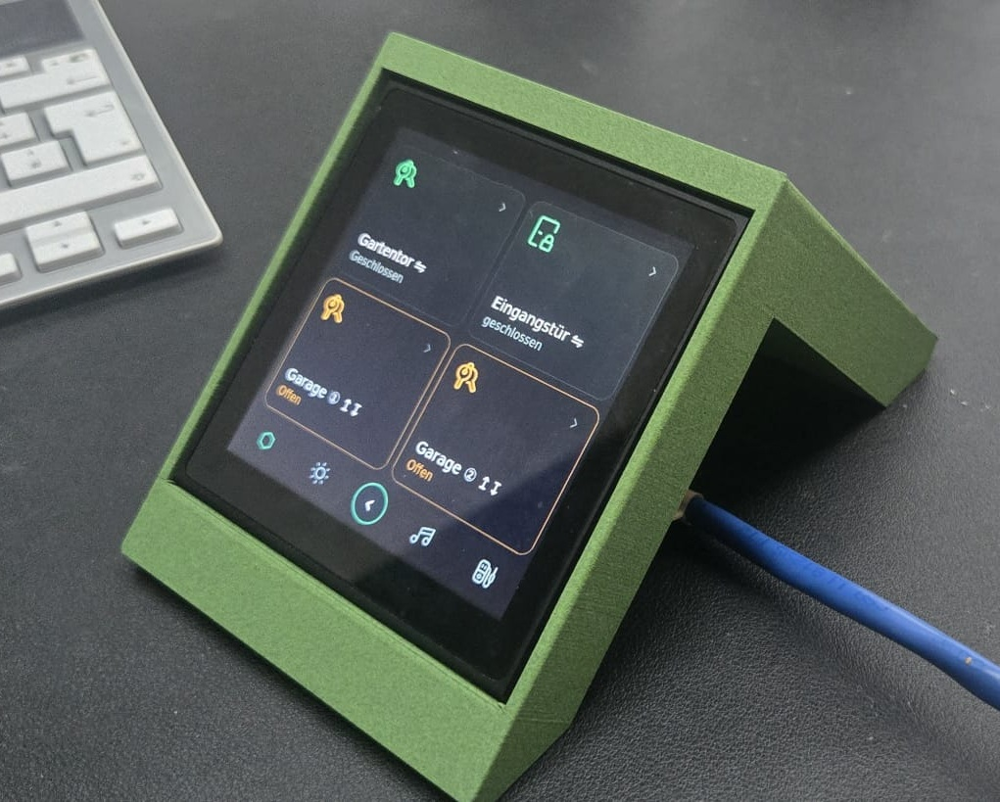
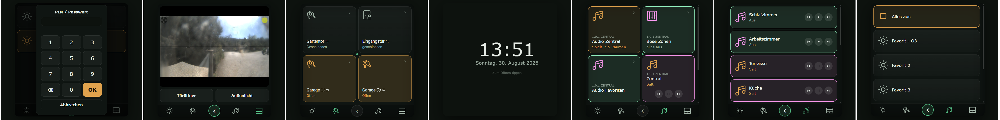
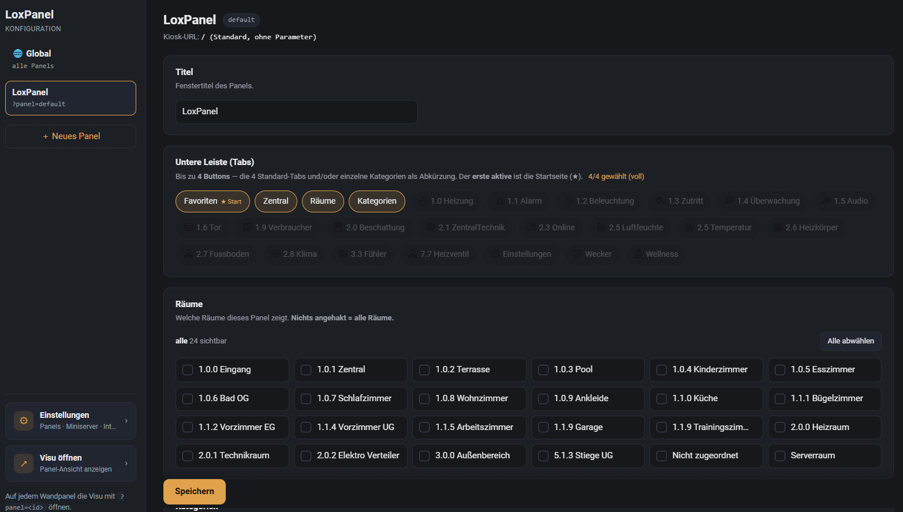
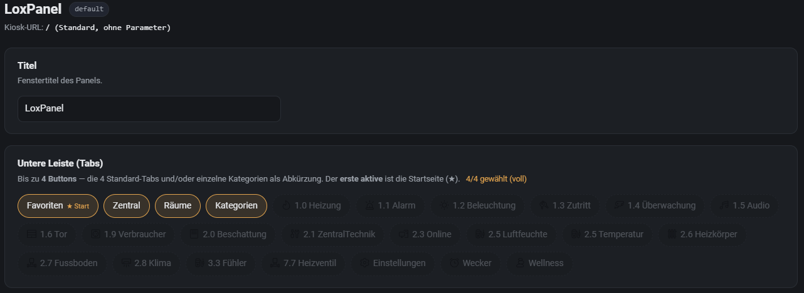
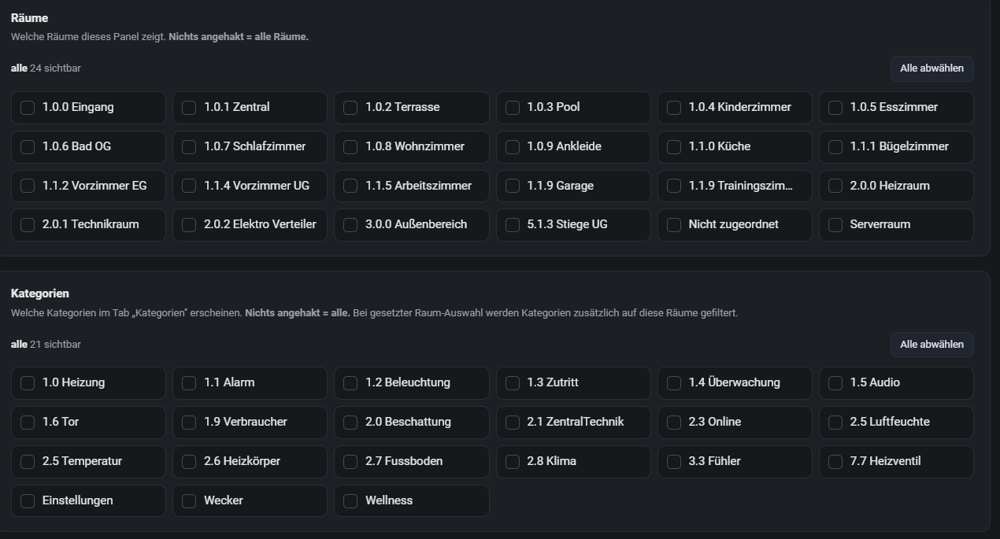
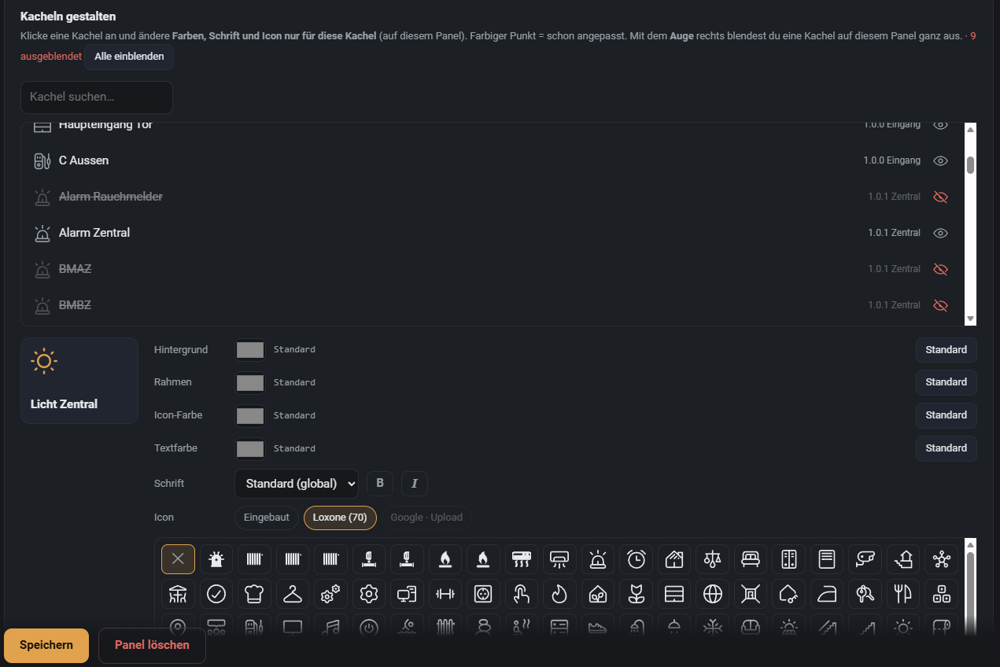
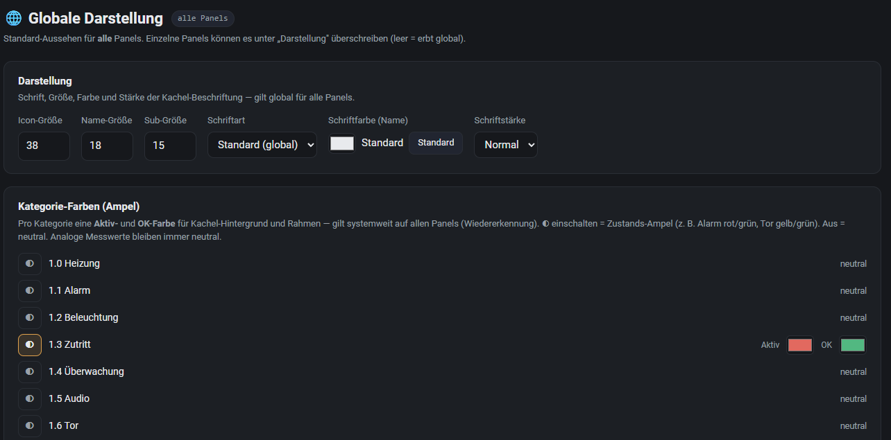
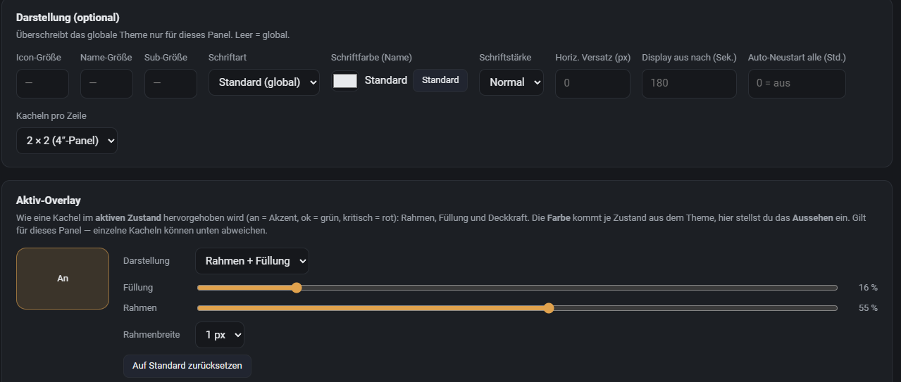
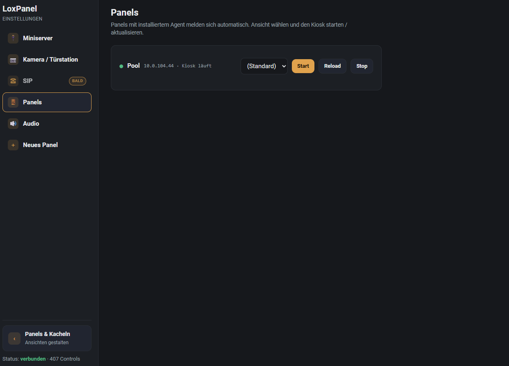

# LoxPanel

**Eine konfigurierbare Touch-Visu für Loxone** – verwandelt jedes Display
(Wandpanel, Tablet oder Handy) in eine aufgeräumte, frei gestaltbare
Bedienoberfläche für den Loxone Miniserver. LoxPanel läuft als **Docker-Container
auf dem LoxBerry** (Plug&Play-Plugin); eingerichtet und gestaltet wird alles im
Browser – ganz ohne Programmierung und ohne die Loxone-App.

> Status: **lauffähig & produktiv einsetzbar.** Verbindet sich per WebSocket mit
> dem Miniserver (Token-Auth), liest die Struktur automatisch ein und steuert live.

## Inhalt

- [Funktionen](#funktionen)
- [Unterstützte Bausteine](#unterstützte-bausteine)
- [Der Panel-Agent (Wandpanel-Kiosk)](#der-panel-agent-wandpanel-kiosk)
- [Voraussetzungen](#voraussetzungen)
- [Installation als LoxBerry-Plugin](#installation-als-loxberry-plugin)
- [Konfiguration](#konfiguration)
- [Updates](#updates)
- [Sicherung (Backup & Wiederherstellung)](#sicherung-backup--wiederherstellung)
- [Datenschutz](#datenschutz)
- [Weitere Installationsarten](#weitere-installationsarten-ohne-loxberry)
- [Architektur](#architektur)
- [Roadmap](#roadmap)
- [Changelog](#changelog)

## Screenshots

**Am Gerät** — 4-Zoll-Touchpanel (hier im 3D-gedruckten Tischständer) mit der Favoriten-Ansicht:



**Visu am Panel** — PIN-Tür, Intercom-Livebild, Garage/Favoriten, Screensaver-Uhr, Musik (Zentral & Raum-Player):



**Konfigurator – Übersicht** — Panels anlegen, Titel, untere Tab-Leiste und sichtbare Räume je Panel:



**Name & Tabs** — bis zu 4 Buttons (Standard-Tabs und/oder Kategorie-Abkürzungen), erster aktiver = Startseite:



**Räume & Kategorien** — Whitelist pro Panel: welche Räume/Kategorien das Gerät zeigt:



**Kacheln gestalten & ausblenden** — pro Kachel Farben, Schrift und Icon (eingebaut / Loxone / Google / Upload); einzelne Kacheln ausblenden:



**Globale Darstellung & Kategorie-Ampel** — Schrift/Größen systemweit; pro Kategorie Aktiv-/OK-Farbe (Zustands-Ampel):



**Panel-Darstellung (optional) & Aktiv-Overlay** — je Panel Overrides, Display-Abschaltzeit, Auto-Neustart, Kacheln pro Zeile, Overlay-Transparenz:



**Einstellungen – verwaltete Panels** — Panels mit [Agent](#der-panel-agent-wandpanel-kiosk) melden sich automatisch; Ansicht wählen, Kiosk Start/Reload/Stop:



## Funktionen

- **Automatische Struktur-Erkennung:** verbindet sich mit dem Miniserver und liest
  Räume, Kategorien und Bausteine automatisch ein – kein manuelles Anlegen von
  Bedienelementen.
- **Navigation wie die Loxone-App:** untere Tab-Leiste **Favoriten / Zentral /
  Räume / Kategorien**, scrollbare Kachelseiten, Detailseiten je Baustein.
- **Übersicht mit Farben & Werten:** aktive Kacheln farbig hervorgehoben, Alarm
  grün „Ok", Zentral-Bausteine mit Zähltext („Licht in X Räumen", „Musik in X
  Räumen"), Energie/Temperatur/Statustexte mit Einheiten-Skalierung.
- **Frei gestaltbare Panels (Profile):** beliebig viele Ansichten – z. B.
  „Wohnzimmer", „Poolhaus", „Handy". Pro Panel wählbar, **welche** Räume,
  Kategorien und Tabs sichtbar sind; einzelne Kacheln gezielt ausblenden.
- **Pro-Kachel-Styling:** je Kachel Hintergrund, Rahmen, Icon- und Textfarbe,
  Schrift und Icon (eingebaute Icons, Loxone-Icons, eigene). Konfigurierbares
  Aktiv-Overlay (Farbe/Transparenz von Füllung und Rahmen), global oder pro Kachel.
- **Ein Design für alle Geräte:** dieselbe Oberfläche skaliert auf Wandpanel,
  Tablet und Smartphone.
- **Musik** (Loxone AudioZone): Zonen-Liste mit Mini-Player (◀ ⏯ ▶) und voller
  Raum-Player mit Cover (über den Miniserver).
- **Intercom** (z. B. Mobotix T25): Live-Bild (MJPEG mit Auth), Tür öffnen &
  Außenlicht, Klingel-Popup (der Server erkennt den `bell`-State und schiebt die
  Ansicht aufs Panel). Gegensprechen (SIP) folgt.
- **Theming:** Kategorie-Farben, Zustandsfarben, Icon-/Schriftgrößen, sichtbare
  Tabs und Schrift zentral einstellbar.
- **Sicherung an Bord:** Backup & Wiederherstellung der kompletten Konfiguration
  direkt im Plugin – überlebt auch Updates.

## Unterstützte Bausteine

LoxPanel erkennt die Bausteine automatisch aus der Miniserver-Struktur (kein manuelles Anlegen von Bedienelementen). Aktueller Stand: **39 voll unterstützt**, **6 teilweise**, **16 geplant**.

**Legende:** ✅ unterstützt · 🟡 teilweise · ⬜ geplant

<table>
<thead><tr><th align="left">Loxone-Typ</th><th align="left">Baustein</th><th>Status</th><th align="left">Anmerkung</th></tr></thead>
<tbody>
<tr><th colspan="4" align="left">Audio / Multimedia</th></tr>
<tr><td><code>CentralAudioZone</code></td><td>Zentral Audio</td><td align="center">✅</td><td></td></tr>
<tr><td><code>Radio</code></td><td>Radio / Auswahlschalter</td><td align="center">✅</td><td></td></tr>
<tr><td><code>AudioZone</code></td><td>Audiozone (Music Server)</td><td align="center">🟡</td><td>Play/Pause/Skip; Musikauswahl Platzhalter</td></tr>
<tr><td><code>MediaClient</code></td><td>Media Client</td><td align="center">⬜</td><td></td></tr>
<tr><th colspan="4" align="left">Bedienelemente</th></tr>
<tr><td><code>Pushbutton</code></td><td>Virtueller Taster</td><td align="center">✅</td><td>Puls</td></tr>
<tr><td><code>Slider</code></td><td>Schieberegler / Analogwert</td><td align="center">✅</td><td></td></tr>
<tr><td><code>Switch</code></td><td>Schalter</td><td align="center">✅</td><td>Ein/Aus</td></tr>
<tr><td><code>ColorPicker</code></td><td>Farbauswahl (alt)</td><td align="center">✅</td><td></td></tr>
<tr><td><code>MoodSwitch</code></td><td>Stimmungsschalter</td><td align="center">⬜</td><td></td></tr>
<tr><td><code>Remote</code></td><td>Fernbedienung</td><td align="center">⬜</td><td></td></tr>
<tr><td><code>TextInput</code></td><td>Texteingabe</td><td align="center">🟡</td><td></td></tr>
<tr><td><code>UpDownAnalog</code></td><td>Auf/Ab (analog)</td><td align="center">🟡</td><td></td></tr>
<tr><td><code>UpDownDigital</code></td><td>Auf/Ab-Taster (digital)</td><td align="center">✅</td><td></td></tr>
<tr><td><code>ValueSelector</code></td><td>Wertselektor</td><td align="center">✅</td><td></td></tr>
<tr><th colspan="4" align="left">Beleuchtung</th></tr>
<tr><td><code>CentralLightController</code></td><td>Zentral Beleuchtung</td><td align="center">✅</td><td>Sammelsteuerung</td></tr>
<tr><td><code>LightController</code></td><td>Beleuchtung (Generation 1)</td><td align="center">✅</td><td></td></tr>
<tr><td><code>LightControllerV2</code></td><td>Beleuchtung (Lichtsteuerung)</td><td align="center">✅</td><td>Szenen/Stimmungen als Liste</td></tr>
<tr><td><code>ColorPickerV2</code></td><td>Farbauswahl RGB/Lumitech</td><td align="center">✅</td><td></td></tr>
<tr><td><code>Dimmer</code></td><td>Dimmer</td><td align="center">✅</td><td></td></tr>
<tr><td><code>LightsceneRGB</code></td><td>RGB-Lichtszene</td><td align="center">⬜</td><td></td></tr>
<tr><th colspan="4" align="left">Beschattung</th></tr>
<tr><td><code>CentralJalousie</code></td><td>Zentral Beschattung</td><td align="center">✅</td><td></td></tr>
<tr><td><code>Jalousie</code></td><td>Beschattung / Jalousie</td><td align="center">✅</td><td>Auf/Ab/Stop, Position</td></tr>
<tr><td><code>WindowMonitor</code></td><td>Fenster-Monitor</td><td align="center">✅</td><td>offen/gekippt-Uebersicht</td></tr>
<tr><td><code>CentralWindow</code></td><td>Zentral Fenster</td><td align="center">✅</td><td></td></tr>
<tr><td><code>Window</code></td><td>Fenster (Motor)</td><td align="center">✅</td><td></td></tr>
<tr><th colspan="4" align="left">Energie</th></tr>
<tr><td><code>EnergyManager2</code></td><td>Energiemanager</td><td align="center">⬜</td><td></td></tr>
<tr><td><code>Fronius</code></td><td>Fronius Wechselrichter</td><td align="center">✅</td><td></td></tr>
<tr><td><code>LoadManager</code></td><td>Lastmanager</td><td align="center">⬜</td><td></td></tr>
<tr><td><code>SolarPumpController</code></td><td>Solarpumpen-Steuerung</td><td align="center">⬜</td><td></td></tr>
<tr><td><code>SpotPriceOptimizer</code></td><td>Strompreis-Optimierer</td><td align="center">⬜</td><td></td></tr>
<tr><td><code>Wallbox</code></td><td>Wallbox / Ladestation</td><td align="center">⬜</td><td></td></tr>
<tr><th colspan="4" align="left">Klima / Heizung</th></tr>
<tr><td><code>AcControl</code></td><td>Klimaanlage / AC</td><td align="center">✅</td><td>Modus/Fan/Soll</td></tr>
<tr><td><code>ClimateControllerUS</code></td><td>Klimaregelung (US)</td><td align="center">✅</td><td></td></tr>
<tr><td><code>IRoomControllerV2</code></td><td>Intelligente Raumregelung</td><td align="center">✅</td><td>Ist/Soll, Modi</td></tr>
<tr><td><code>ClimateController</code></td><td>Klimaregelung (EU)</td><td align="center">⬜</td><td></td></tr>
<tr><td><code>Heatmixer</code></td><td>Heizungsmischer</td><td align="center">⬜</td><td></td></tr>
<tr><td><code>IRoomController</code></td><td>Raumregelung (alt)</td><td align="center">⬜</td><td></td></tr>
<tr><td><code>Sauna</code></td><td>Sauna-Steuerung</td><td align="center">⬜</td><td></td></tr>
<tr><td><code>Ventilation</code></td><td>Lueftung</td><td align="center">🟡</td><td></td></tr>
<tr><th colspan="4" align="left">Sensorik / Anzeige</th></tr>
<tr><td><code>Hourcounter</code></td><td>Betriebsstundenzaehler</td><td align="center">✅</td><td>inkl. Wartung faellig</td></tr>
<tr><td><code>InfoOnlyAnalog</code></td><td>Statusanzeige (analog)</td><td align="center">✅</td><td>Wert + Format</td></tr>
<tr><td><code>InfoOnlyDigital</code></td><td>Statusanzeige (digital)</td><td align="center">✅</td><td>Ein/Aus-Text</td></tr>
<tr><td><code>InfoOnlyText</code></td><td>Textanzeige</td><td align="center">✅</td><td></td></tr>
<tr><td><code>Meter</code></td><td>Verbrauchszaehler</td><td align="center">✅</td><td></td></tr>
<tr><td><code>SystemScheme</code></td><td>Anlagenschema</td><td align="center">✅</td><td>nur Hinweis-Kachel</td></tr>
<tr><td><code>TextState</code></td><td>Zustandstext</td><td align="center">✅</td><td></td></tr>
<tr><td><code>Tracker</code></td><td>Ereignis-Logger</td><td align="center">✅</td><td>Verlaufszeilen</td></tr>
<tr><th colspan="4" align="left">Sicherheit</th></tr>
<tr><td><code>Alarm</code></td><td>Alarmanlage</td><td align="center">✅</td><td>scharf/unscharf, quittieren</td></tr>
<tr><td><code>CentralAlarm</code></td><td>Zentral Alarm</td><td align="center">✅</td><td></td></tr>
<tr><td><code>PresenceDetector</code></td><td>Praesenzmelder</td><td align="center">✅</td><td></td></tr>
<tr><td><code>SmokeAlarm</code></td><td>Brandmelder / Rauchmelder</td><td align="center">✅</td><td></td></tr>
<tr><th colspan="4" align="left">Sonstiges</th></tr>
<tr><td><code>PoolController</code></td><td>Pool-Steuerung</td><td align="center">⬜</td><td></td></tr>
<tr><td><code>Sequential</code></td><td>Sequenzer</td><td align="center">⬜</td><td></td></tr>
<tr><td><code>Webpage</code></td><td>Webseite (eingebettet)</td><td align="center">✅</td><td></td></tr>
<tr><th colspan="4" align="left">Tor / Zutritt</th></tr>
<tr><td><code>CentralGate</code></td><td>Zentral Tor</td><td align="center">✅</td><td></td></tr>
<tr><td><code>Gate</code></td><td>Tor / Garagentor</td><td align="center">✅</td><td>Position, Auf/Zu</td></tr>
<tr><td><code>Intercom</code></td><td>Tuersprechanlage</td><td align="center">🟡</td><td>Kamera/Klingel-Popup; SIP folgt</td></tr>
<tr><td><code>NfcCodeTouch</code></td><td>NFC Code Touch</td><td align="center">⬜</td><td></td></tr>
<tr><th colspan="4" align="left">Zeit / Automatik</th></tr>
<tr><td><code>TimedSwitch</code></td><td>Treppenhaus-/Zeitschalter</td><td align="center">✅</td><td>Restzeit, pulse/off</td></tr>
<tr><td><code>AlarmClock</code></td><td>Wecker</td><td align="center">🟡</td><td>read-only Anzeige + Weckton/Alarm (kein Bearbeiten)</td></tr>
<tr><td><code>Daytimer</code></td><td>Wochenuhr / Zeitplan</td><td align="center">✅</td><td></td></tr>
</tbody>
</table>

## Der Panel-Agent (Wandpanel-Kiosk)

Für ein **dediziertes Linux-Wandpanel** (z. B. ein 4-Zoll-PX30-Panel im
Chromium-Kiosk) gibt es einen kleinen, **optionalen** Helfer: den **Panel-Agent**.

> **Wichtig zum Verständnis:** Der Agent ist **nicht** Teil des LoxBerry-Containers.
> Er läuft **direkt auf dem Wandpanel**. Tablets, Handys oder ein normaler Browser
> brauchen ihn **nicht** – die rufen einfach die Visu-URL des LoxBerry auf. Der
> Agent lohnt sich nur, wenn ein Panel als fest verbauter Kiosk laufen soll.

**Warum getrennt?** Der LoxPanel-Server (im LoxBerry-Container) liefert die Visu.
Die **lokale Hardware des Panels** – Bildschirm, Hintergrundbeleuchtung, der
Chromium-Kiosk – kann ein Container auf dem LoxBerry aber nicht steuern. Genau das
übernimmt der Agent auf dem Gerät.

**Was der Agent macht:**

- **Kiosk-Autostart:** startet Chromium im Vollbild mit der richtigen Panel-URL
  (`?panel=<id>`) automatisch beim Booten.
- **Auto-Discovery:** meldet das Panel selbstständig beim Server – es erscheint in
  **Einstellungen → Panels**. Von dort lässt sich die Ansicht wählen und der Kiosk
  **fernstarten / neu laden**.
- **Echte Display-Abschaltung:** schaltet nach Inaktivität nicht nur das Bildsignal,
  sondern die **Hintergrundbeleuchtung** ab (alle Backlight-Devices) → das Panel
  wird wirklich dunkel **und kühl**. Antippen weckt es sofort.
- **Stromspar-Pause:** friert den Chromium-Kiosk bei dunklem Display ein und setzt
  ihn beim Aufwachen fort → deutlich weniger CPU-Last und Wärme im Ruhezustand.
- **Auto-Neustart gegen Einfrieren:** startet den Kiosk optional periodisch neu,
  falls der Browser mal hängt.
- **Robuster Neustart:** bereinigt nach einem Stromausfall den „Wiederherstellen?"-
  Dialog von Chromium, damit der Kiosk ohne Eingriff wieder hochkommt.

**Installation (per SSH auf dem Panel):** ein Skript richtet Agent + Autostart ein:

```bash
SERVER=<loxberry-ip>:8099 bash deploy/install-agent.sh
```

Einstellungen danach in `/etc/loxpanel/kiosk.conf` – u. a.:

| Schlüssel | Bedeutung |
|---|---|
| `SERVER` | IP:Port des LoxPanel-Servers (LoxBerry) |
| `PANEL` | Panel-Profil / Startansicht (leer = Standard) |
| `DPMS_OFF` | Sekunden bis zur Display-Abschaltung (0 = nie) |
| `BL_ON` | Helligkeit im Ein-Zustand (0…max; leer = voll) |
| `PAUSE_ON_BLANK` | Chromium bei dunklem Display einfrieren (Standard 0 = aus; 1 spart CPU/Wärme, verzögert aber das Reagieren nach dem Aufwachen um ~30 s) |
| `AUTOSTART` | Kiosk beim Booten starten (1) oder nur auf Fernstart warten (0) |

Details: [`deploy/DEPLOY.md`](deploy/DEPLOY.md).

## Voraussetzungen

- **LoxBerry 3.0** oder neuer.
- Architektur **aarch64 / x86_64 / armhf** (Raspberry Pi 3/4/5 und x86).
- **Docker** – wird vom Plugin bei Bedarf automatisch installiert.
- Erreichbarer **Loxone Miniserver** (Gen1 oder Gen2).

## Installation als LoxBerry-Plugin

1. LoxBerry → **Plugin-Verwaltung**.
2. Plugin per ZIP-URL installieren:
   `https://github.com/Lenardo1/Loxpanel/releases/latest/download/loxpanel-plugin.zip`
3. Das Plugin installiert bei Bedarf Docker und startet den LoxPanel-Container
   automatisch. Danach erreichst du alles über das Plugin-Widget in LoxBerry.

## Konfiguration

**1. Miniserver verbinden** – im Plugin-Widget IP, Benutzer, Passwort und Port
eintragen, oder mit einem Klick **„Aus LoxBerry übernehmen"**: LoxPanel holt sich
den Zugang aus der **zentralen LoxBerry-Miniserver-Konfiguration**. Anschließend
lädt es die Struktur automatisch.

**2. Panels & Kacheln gestalten** – über **„Panels & Kacheln öffnen"** landest du
im Konfigurator: Ansichten anlegen, Räume/Kategorien/Tabs je Panel wählen, Kacheln
ein-/ausblenden, Farben, Icons und Schrift pro Kachel einstellen.

**3. Panels verwalten** – unter **„Settings öffnen"** siehst du alle Wandpanels mit
[installiertem Agent](#der-panel-agent-wandpanel-kiosk), wählst deren Ansicht und
startest/aktualisierst den Kiosk aus der Ferne.

**Panel-Profile im Detail:** Ein Server versorgt beliebig viele Panels; jedes Gerät
kann eine eigene Visu zeigen. Der Kiosk ruft die Seite mit `?panel=<id>` auf; der
Server lädt das passende Profil. Pro Profil einstellbar: sichtbare Tabs, Whitelist
der Räume/Kategorien (UUID oder Name, Teilstring genügt), Theme-Override und
Zustandsfarben. Ohne Profil verhält sich ein Panel wie `default` (alles sichtbar).

## Updates

- **App-Updates** (neue LoxPanel-Version) holst du im Plugin-Widget per Button
  **„Jetzt updaten / Neu starten"** – zieht das aktuelle Image und startet neu.
- Der Fortschritt wird live im **Log-Fenster** angezeigt.
- Deine Panels und Einstellungen bleiben dabei **immer erhalten** (eigenes
  Daten-Volume; zusätzlich werden sie bei Plugin-Updates gesichert).

## Sicherung (Backup & Wiederherstellung)

Im Plugin-Widget unter **„Panels sichern & wiederherstellen"** legst du jederzeit
ein Backup der kompletten Konfiguration (Panels, Kacheln, Theme, Miniserver-Zugang)
an. Die Archive liegen auf dem LoxBerry unter
`data/plugins/loxpanel/backups/` und **überleben Plugin-Updates**. Aus der Liste
lässt sich ein Stand mit einem Klick wiederherstellen (der aktuelle Stand wird
vorher automatisch gesichert).

## Datenschutz

LoxPanel läuft **vollständig lokal**: Die Verbindung besteht nur zwischen LoxBerry
und dem Miniserver in deinem Netz. Es gibt **keine Cloud**, kein Konto und keine
Telemetrie. Zugangsdaten liegen ausschließlich lokal im Daten-Volume.

## Weitere Installationsarten (ohne LoxBerry)

LoxPanel ist ein normaler Docker-Dienst und läuft auch ohne LoxBerry – gleiche
Server-Basis, gleiches Image `ghcr.io/lenardo1/loxpanel:latest` (multi-arch:
amd64 / arm64 / **armv7**).

**Portainer / docker compose:**

```yaml
services:
  loxpanel:
    image: ghcr.io/lenardo1/loxpanel:latest
    container_name: loxpanel
    restart: unless-stopped
    ports:
      - "8099:8099"
    environment:
      LOXPANEL_MS_HOST: "192.168.1.50"     # Miniserver-IP
      LOXPANEL_MS_USER: "LoxoneUser"
      LOXPANEL_MS_PASS: "dein-passwort"
      LOXPANEL_MS_PORT: "443"
      LOXPANEL_MS_VERIFY_TLS: "false"       # Gen2 selbstsigniert -> false
    volumes:
      - loxpanel_config:/app/config          # panels.json / theme.json / loxpanel.cfg persistent
volumes:
  loxpanel_config:
```

Danach: Visu `http://<host>:8099`, Konfig `…/config`, Einstellungen `…/settings`.
Zugangsdaten per Env **oder** leer lassen und in `/settings` eintragen.

**Für Entwickler (Standalone):**

```bash
pip install loxone-api            # zieht aiohttp mit
cp config/loxpanel.cfg.example config/loxpanel.cfg   # Miniserver eintragen (gitignored)
python bin/webvisu.py             # -> http://localhost:8099
```

Details: [`deploy/DOCKER.md`](deploy/DOCKER.md) / [`deploy/DEPLOY.md`](deploy/DEPLOY.md).

## Architektur

```
Loxone Miniserver ──WebSocket(Token)──►  webvisu.py (aiohttp)   ─┐
        ▲  (Befehle via loxone-api / jdev)      │  WebSocket+HTTP │ Docker-Container
        └───────────────────────────────────────┘                │ (LoxBerry-Plugin)
                                                 ▼               ─┘
                                       Browser-Panel (Kacheln, Tabs, Detailseiten)
                                       ├─ Wandpanel: Chromium-Kiosk + Panel-Agent
                                       └─ Tablet / Handy: einfach die URL öffnen
```

- **loxone-api** (PyPI): Token-Auth (getkey2/getjwt), Struktur, Befehle.
- **loxone_ws.py**: WebSocket-Client für Live-Werte (binäre State-Tabellen).
- **adapters.py**: pro Control-Typ ein Adapter (Zustand → Kachel, Aktion → Befehl).
- **webvisu.py**: Server – baut Views/Blocks, streamt sie per WebSocket, proxyt
  Icons/Cover/MJPEG, sendet das Theme.
- **panel.html**: die Single-Page-Visu (Kacheln, Detail-Panels, Tabs, Theme).
- **agent/loxpanel-agent.py**: der [Panel-Agent](#der-panel-agent-wandpanel-kiosk)
  auf dem Wandpanel.

## Roadmap

- Intercom Teil 2: **Gegensprechen** (SIP-Client auf dem Panel).
- Weitere Bausteine (u. a. Remote, AudioZoneV2) und Heizung-Modus-Umschaltung.
- Musiksteuerung mit austauschbarem Audio-Backend (MS4H/LMS).
- Optionaler openHASP-Renderer (ESP32) als kuratierter Satellit.

## Changelog

- **0.2.6** – Miniserver-Felder nebeneinander (mehr Platz); Button „Aus LoxBerry übernehmen".
- **0.2.5** – Backup & Wiederherstellung der Konfiguration im Plugin-Widget.
- **0.2.4** – Container-Aktionen laufen im Hintergrund + Live-Statuslog (kein Timeout mehr).
- **0.2.x** – erstes öffentliches LoxBerry-Plugin (Docker, automatische Installation).

## Support & Quellcode

Fragen, Ideen und Fehlerberichte gerne als GitHub-Issue:
<https://github.com/Lenardo1/Loxpanel>
